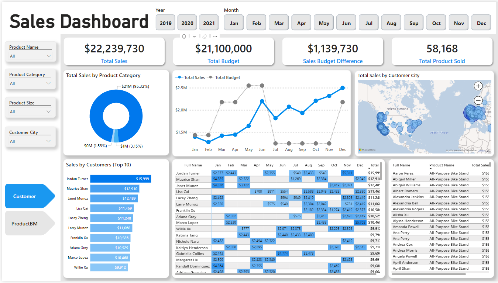
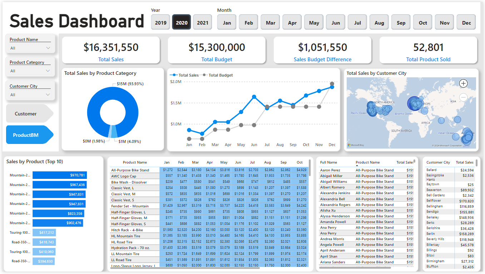

# Online Store Dashboard

An online shopping store request to improve their current sales report from static report to dynamic visual reports / dashboard. Additionally, they want to include in the new dashboard their latest online sales report and compared it from the previous year. They want to see how many products are being sold, where it was sold and how many of them are sold to a specific customer.

## Business Demand 

### Overview

- Requested by: Sales Manager
- Change Request: Visual dynamic dashboards with improvde Sales reporting metrics
- Application/Software: Power BI, SQL, Excel
- Other relevant Infos: Excel dataset (Budget 2021), SQL Database access

<b>Key points:</b>
- Analyze into more details the following KPIs Total sales, total budget alloted, difference of alloted budget from sales, total sold product.
- Display how much products sold to which client and how it has been over time.
- Sales manager / Sales person (viewer and user) should be able to filter reports by date, months, customer, product, category and city.
- Provide dashboard to display all the reports that can be refreshed every time they have new data.

### User Stories

<b>Role: Sales Manager</b>

<b>Request:</b> Detail overview of Online Sales

<b>Value / Purpose:</b>
  - To continuously follow the progress on which customers and products sells the best
  - To monitor sales over time against budget alloted for the year
    
<b>Proposal:</b> Power BI Dashboard with dynamic reports using graphs, tables and KPIs

<b>Role: Sales Representative</b>

<b>Request:</b> Detail overview of Online Sales specifically on Customers and Products

<b>Value / Purpose:</b>
  - To closely monitor customers that buy the most products
  - To monitor sales of products that sells the best
    
<b>Proposal:</b> Power BI Dashboard with filterable reports

## Metrics
- Total Sales
- Total Product Sold
- Total Budget
- Sales Budget Difference
- Top Customer and Products

## Data Visualization
Full page link of the Interactive Power BI Dashboard click this link - [App Power BI link](https://app.powerbi.com/reportEmbed?reportId=ab86eeef-e986-4a47-ba2d-28199c7f2942&autoAuth=true&ctid=a4e78b81-874a-4832-88f0-12bd163108f4)

## Data Access

<b>A one time SQL Database access was given to extract the needed data for the reports using following SQL queries:</b>

InternetSales Table 

        SELECT 
          [ProductKey], 
          [OrderDateKey], 
          [DueDateKey], 
          [ShipDateKey], 
          [CustomerKey], 
          [SalesOrderNumber], 
          [SalesAmount] 
        FROM 
          [AdventureWorksDW2019].[dbo].[FactInternetSales]
        WHERE 
          LEFT (OrderDateKey, 4) >= YEAR(GETDATE()) -2 -- Ensures we always only bring two years of date from extraction.
        ORDER BY
          OrderDateKey ASC

Product Table 

        SELECT 
          p.[ProductKey], 
          p.[ProductAlternateKey] AS ProductItemCode, 
          p.[EnglishProductName] AS [Product Name], 
          ps.EnglishProductSubcategoryName AS [Sub Category], -- Joined in from Sub Category Table
          pc.EnglishProductCategoryName AS [Product Category], -- Joined in from Category Table
          p.[Color] AS [Product Color], 
          p.[Size] AS [Product Size], 
          p.[ProductLine] AS [Product Line], 
          p.[ModelName] AS [Product Model Name], 
          p.[EnglishDescription] AS [Product Description], 
          ISNULL (p.Status, 'Outdated') AS [Product Status] 
        FROM 
          [AdventureWorksDW2019].[dbo].[DimProduct] as p
          LEFT JOIN dbo.DimProductSubcategory AS ps ON ps.ProductSubcategoryKey = p.ProductSubcategoryKey 
          LEFT JOIN dbo.DimProductCategory AS pc ON ps.ProductCategoryKey = pc.ProductCategoryKey 
        ORDER BY 
          p.ProductKey asc

          
Customer Table

        SELECT 
          c.customerkey AS CustomerKey, 
          c.firstname AS [First Name],  
          c.lastname AS [Last Name], 
          c.firstname + ' ' + lastname AS [Full Name], 
          CASE c.gender WHEN 'M' THEN 'Male' WHEN 'F' THEN 'Female' END AS Gender,
          c.datefirstpurchase AS DateFirstPurchase, 
          g.city AS [Customer City] -- Joined in Customer City from Geography Table
        FROM 
          [AdventureWorksDW2019].[dbo].[DimCustomer] as c
          LEFT JOIN dbo.dimgeography AS g ON g.geographykey = c.geographykey 
        ORDER BY 
          CustomerKey ASC -- Ordered List by CustomerKey
      

Calendar Table 

        SELECT 
          [DateKey], 
          [FullDateAlternateKey] AS Date, 
          [EnglishDayNameOfWeek] AS Day, 
          [EnglishMonthName] AS Month, 
          Left([EnglishMonthName], 3) AS MonthShort,   -- Useful for front end date navigation and front end graphs.
          [MonthNumberOfYear] AS MonthNo, 
          [CalendarQuarter] AS Quarter, 
          [CalendarYear] AS Year --[CalendarSemester] 
        FROM 
         [AdventureWorksDW2019].[dbo].[DimDate]
        WHERE 
          CalendarYear >= 2019

## Summary of Insights

  - 
  - Pizza sells the most during weekdays (Sunday and Saturday) and lowest every Tuesday
  - July had the highest number of orders followed by January, March, May and August, with the lowest in October.
  - Each pizza category sells almost evenly - Classic (27%), Supreme (25%), Chicken (24%), Veggie (24%)

## Recommendations

  - Weekly restocking of supplies should be done a day or two prior the most selling day of the week (Sunday and Saturday)
  - Focus more on restocking monthly for the following top selling months - Januray, March, May, July and August
  - Consider adding another menu category (Meaty, Beefy, etc) to add more variety on the flavor.
  - Focus more on selling L, M, S sizes of pizza instead of XL and XXL, as these two had the lowest sales.

