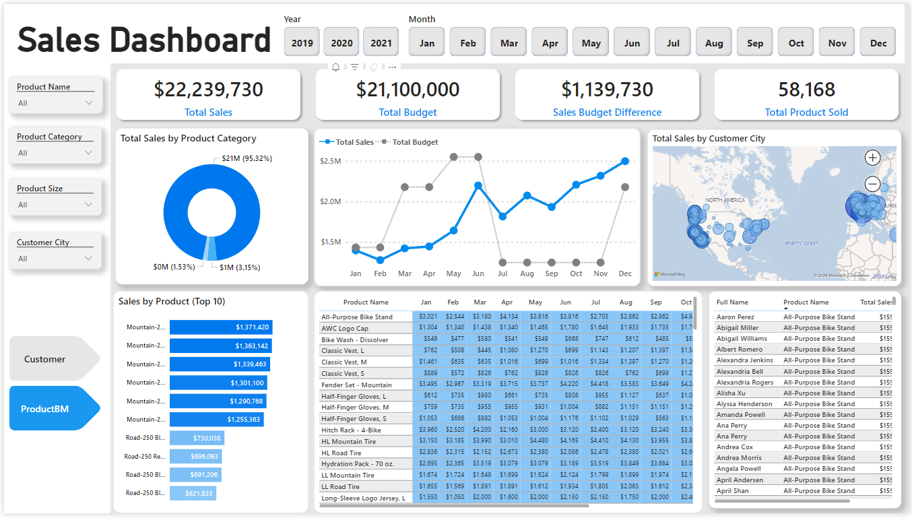

# Online Store Dashboard

An online shopping store request to improve their current sales report from static report to dynamic visual reports / dashboard. Additionally, they want to include in the new dashboard their latest online sales report and compared it from the previous year. They want to see how many products are being sold, where it was sold and how many of them are sold to a specific customer.

## Business Demand 

### Overview

- Requested by: Sales Manager
- Change Request: Visual dynamic dashboards with improvde Sales reporting metrics
- Application/Software: Power BI, SQL, Excel
- Other relevant Infos: Excel dataset (Budget 2021), SQL Database access

<b>Key points:</b>
- Analyze into more details the following KPIs Total sales, total budget alloted, difference of alloted budget from sales, total sold product.
- Display the how much products sold to which client and how it has been over time.
- Sales manager / Sales person (viewer and user) should be able to filter reports by date, months, customer, product, category and city.
  

## Metrics
- Total Revenue - sum of price of pizza orders
- Total Pizza Sold - sum of the quantities of pizzas sold 

## Data Visualization
Full page link of the Interactive Power BI Dashboard click this link - [App Power BI link](https://app.powerbi.com/reportEmbed?reportId=ab86eeef-e986-4a47-ba2d-28199c7f2942&autoAuth=true&ctid=a4e78b81-874a-4832-88f0-12bd163108f4)

## Summary of Insights

  - Pizza sells the most during weekdays (Sunday and Saturday) and lowest every Tuesday
  - July had the highest number of orders followed by January, March, May and August, with the lowest in October.
  - Each pizza category sells almost evenly - Classic (27%), Supreme (25%), Chicken (24%), Veggie (24%)

## Recommendations

  - Weekly restocking of supplies should be done a day or two prior the most selling day of the week (Sunday and Saturday)
  - Focus more on restocking monthly for the following top selling months - Januray, March, May, July and August
  - Consider adding another menu category (Meaty, Beefy, etc) to add more variety on the flavor.
  - Focus more on selling L, M, S sizes of pizza instead of XL and XXL, as these two had the lowest sales.

